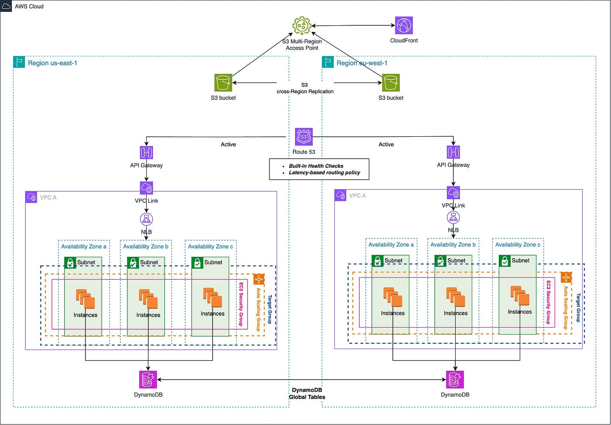

# AWS Multi-Region Disaster Recovery & High Availability


# AWS Multi-Region Disaster Recovery and High Availability
===========================================================

## Overview
--------

This project provides a comprehensive framework for deploying a multi-region disaster recovery (DR) and high availability (HA) environment on AWS. It leverages AWS services such as Route 53 for DNS failover, AWS Global Accelerator for low-latency routing, RDS Multi-AZ for automatic database failover, and S3 Cross-Region Replication for data redundancy. The infrastructure is managed using AWS CloudFormation, allowing for efficient deployment and management across multiple regions.

## Architecture
-------------

The architecture of this project includes:

- **Route 53**: Used for DNS failover to ensure seamless redirection to a standby region in case of an outage.
- **AWS Global Accelerator**: Provides low-latency routing to improve application performance by directing traffic to the nearest region.
- **RDS Multi-AZ**: Ensures database availability by automatically failing over to a standby instance in a different Availability Zone.
- **S3 Cross-Region Replication**: Replicates data across regions to ensure data durability and availability.
- **CloudFormation**: Manages infrastructure as code, simplifying deployment and updates across multiple regions.

## Features
------------

- **Multi-Region Deployment**: Supports deployment across multiple AWS regions.
- **Disaster Recovery**: Includes mechanisms for automatic failover and recovery.
- **High Availability**: Ensures continuous availability of resources.
- **Infrastructure as Code**: Uses CloudFormation for consistent and version-controlled deployments.

## Prerequisites
--------------

- **AWS Account**: An AWS account with necessary permissions.
- **AWS CLI**: The AWS CLI installed and configured on your machine.
- **CloudFormation**: Familiarity with AWS CloudFormation.

## Deployment Steps
-------------------

### Step 1: Clone the Repository
git clone https://github.com/badenson/aws-multi-region-dr-ha.git

### Step 2: Prepare CloudFormation Templates

- Modify the template parameters to suit your environment.
- Ensure you have the necessary AWS services enabled in your account.

### Step 3: Deploy Using CloudFormation

### Step 4: Test and Validate

- Test failover scenarios using Route 53.
- Validate data replication across regions.

### Step 5: Monitor and Optimize

- Use AWS CloudWatch for monitoring.
- Optimize costs by using reserved instances and minimizing data transfer.

## Budget Considerations
-----------------------

- **Use Free Tier**: Where possible, utilize AWS free tier services.
- **Reserved Instances**: Use reserved instances for long-term cost savings.
- **Optimize Data Transfer**: Minimize data movement between regions to reduce costs.

## Contributing
------------

Contributions are welcome! Please submit pull requests with detailed explanations of changes.

## License
-------

[Insert License Information]


## **Architecture**


## **Features**
✅ **Automatic failover** (Route 53 health checks)  
✅ **Cross-region replication** (S3 CRR, RDS read replicas)  
✅ **Low-latency routing** (Global Accelerator)  
✅ **Automated recovery plans** (CloudFormation + Lambda)  

## **Deployment**
```bash
./scripts/deploy.sh

